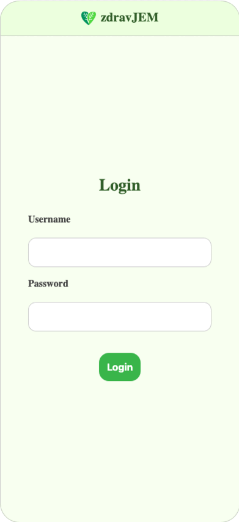

<p align="center">
  
</p>


**zdravJEM** je družabna aplikacija, ki združuje svet zdrave prehrane, umetne inteligence in motivacije s pomočjo prijatelskih odnosov.  
Naša misija? Skupaj preoblikovati vsakdanjo kuhinjo v prostor ustvarjalnosti, zdravja in pozitivne energije.

---

## 💡 Kaj je zdravJEM?

### 📸 Družabno omrežje s pridihom kuhanja
Uporabniki delijo fotografije svojih zdravih jedi, raziskujejo ideje drugih in se med seboj spodbujajo k zdravemu življenjskemu slogu.

### 🧠 Pametni AI algoritem
Aplikacija uporablja umetno inteligenco za prepoznavanje sestavin na vaših fotografijah ter vam:
- ponudi predloge podobnih, a še bolj zdravih jedi,
- pomaga odkriti nove sestavine in boljše prehranske izbire.

### 🏆 Tedenski izziv
Vsak teden aplikacija izbere jed enega izmed vaših prijateljev in vas izzove, da jo poustvarite:
- skuhajte,
- fotografirajte,
- delite rezultat s svojo mrežo.

---

## ❓ Zakaj spodbujamo zdravo prehrano?

- 🫃 **1 od 5 odraslih v Sloveniji je debel** (Evropska komisija, 2023).
- 💔 Nezdrava prehrana prispeva k **16 % vseh smrti v Sloveniji**.
- ❤️ Po podatkih WHO (2024) so **kardiovaskularne bolezni** še vedno glavni vzrok smrti na svetu.

Zato si želimo, da bi družbena omrežja prešla iz »Kdo ima lepšo fotografijo?« v »Kdo je skuhal bolj zdravo in domiselno jed?«

---

## 🚀 Tehnična zasnova in zagon aplikacije

Aplikacija temelji na **moderni tehnologiji**:
- 🎯 **Frontend**: [Angular](https://angular.io) – za odzivno in prijazno uporabniško izkušnjo.
- 🔥 **Baza podatkov in avtentikacija**: [Firebase](https://firebase.google.com) – za shranjevanje uporabnikov, objav in slik.
- 🧠  **Umetna inteligenca**: Flask strežnik (lokalno) s priklopljenimi modeli za računalniški vid.


<p align="center">
  
</p>

### Namestitev (lokalno)

1. **Kloniraj repozitorij**:
   ```bash
    git clone https://github.com/tvoje-uporabnisko-ime/zdravjem.git```
3. **Namesti Angular odvisnosti:**

```bash
cd frontend
npm install
```

3. **Zaženi Angular frontend:**

```bash
ng serve
```

4. **Poganjanje AI modela (Flask strežnik):**

```bash
cd backend
pip install -r requirements.txt
python app.py
```


